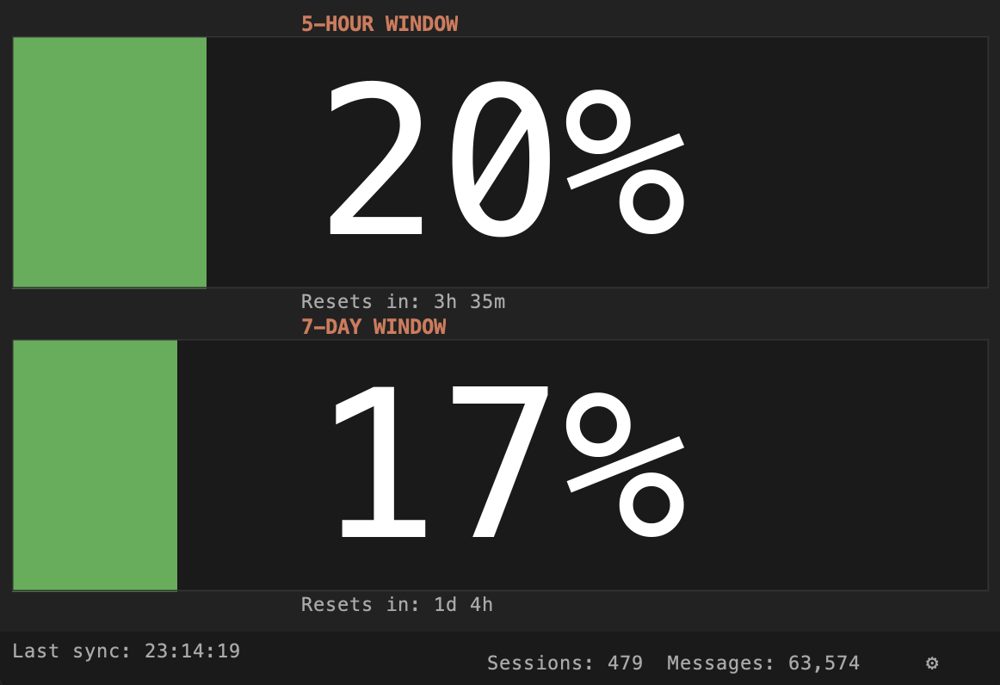

# jclaude-monitor

A lightweight Java desktop app that shows your Claude.ai usage at a glance — 5-hour and 7-day utilization windows, plus all-time session and message counts from the local Claude CLI cache.

Works with **personal and enterprise Claude accounts**.



## Why browser login instead of the Claude API

The obvious approach to monitoring usage would be the Claude API — but that requires creating an API key, which is simply not possible in many enterprise environments where key creation is restricted or disabled by policy. If you're using Claude through an enterprise seat, you likely have no way to generate an API key at all.

Instead, jclaude-monitor authenticates through the claude.ai web interface the same way your browser does. You log in once via an embedded browser window, and the app reuses that session to read your usage data — no API key required, no admin approval needed, works out of the box for both personal and enterprise accounts.

## What it does

- Displays progress bars for your **5-hour** and **7-day** Claude.ai usage windows, with countdown timers until each resets
- Shows **all-time totals** (sessions and messages) sourced from the local Claude CLI stats cache at `~/.claude/stats-cache.json`
- Polls data every **60 seconds** in the background
- Stores your claude.ai session key **encrypted** (AES-256-GCM) in `~/.jclaude-monitor/config.properties`
- Remembers window size, position, and always-on-top preference between launches

## How it works

jclaude-monitor has two data sources:

1. **Local stats** — reads `~/.claude/stats-cache.json` written by the Claude CLI, requiring no credentials
2. **Web usage** — scrapes the claude.ai internal usage endpoint using your browser session key to retrieve live utilization percentages, bypassing the need for an API key entirely

On first launch, open **Settings (⚙)** and click **Login with Claude.ai…** to authenticate via an embedded browser. The session key is captured automatically and saved encrypted to disk. From then on, the app loads it on startup and begins polling immediately.

## Requirements

- Java 25+
- Maven (or use the included `mvnw` wrapper)

## Build

```bash
./mvnw package
```

This produces `target/jclaude-monitor-1.0.0-shaded.jar` — a fat JAR with all dependencies bundled.

## Run

```bash
java -jar target/jclaude-monitor-1.0.0-shaded.jar
```

## Setup (first run)

1. Launch the app — the main window opens showing "No session key"
2. Click the **⚙** button at the bottom right to open Settings
3. Click **Login with Claude.ai…** and sign in via the embedded browser
4. The session is captured, tested, and saved automatically
5. Usage bars populate on the next poll (within a few seconds)

To remove stored credentials at any time, open Settings and click **Clear**.
